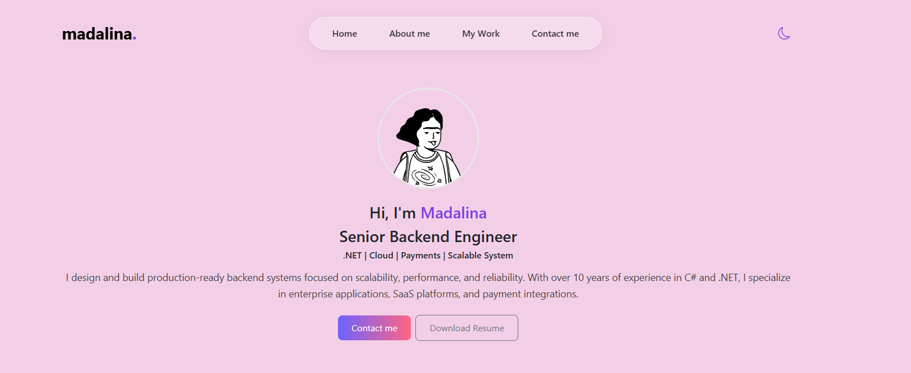
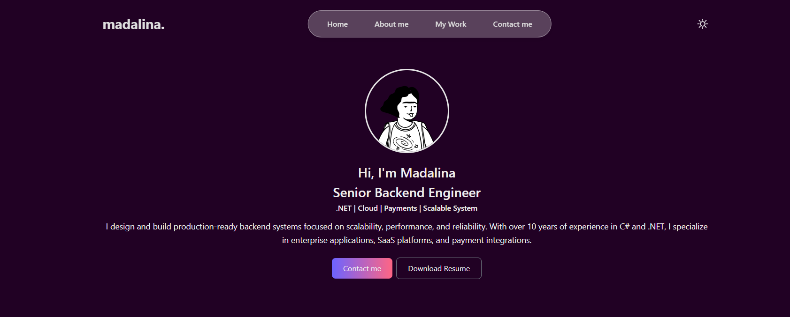

# m-portfolio

A personal portfolio website built with Angular for a backend developer client — designed to be clean, modern, and fully responsive.

🌐 **Live site:** [madalinabuu.github.io/m-portfolio](https://madalinabuu.github.io/m-portfolio/)

---

## Features

- 🌙 **Dark / Light mode toggle** — manual theme switching with smooth transitions
- 📝 **Working contact form** — powered by [Web3Forms API](https://web3forms.com/), no backend required
- 🔄 **Rotating text animation** — dynamic hero section with CSS animation
- 📱 **Fully responsive** — mobile-first layout built with Bootstrap
- 🚀 **Deployed with GitHub Pages**

---

## Tech Stack

| Layer | Technology |
|-------|-----------|
| Framework | Angular |
| Styling | SCSS, Bootstrap |
| Contact Form | Web3Forms API |
| Deployment | GitHub Pages |

---

## Screenshots

### Light Mode


### Dark Mode


---

## Getting Started

### Prerequisites

- Node.js (v16+)
- Angular CLI

```bash
npm install -g @angular/cli
```

### Installation

```bash
# Clone the repository
git clone https://github.com/MadalinaBuu/m-portfolio.git

# Navigate into the project
cd m-portfolio

# Install dependencies
npm install

# Start the development server
ng serve
```

Then open your browser at `http://localhost:4200`.

### Build for production

```bash
ng build --configuration production
```

### Deploy to GitHub Pages

```bash
ng deploy --base-href=/m-portfolio/
```

---

## Project Structure

```
src/
├── app/
│   ├── components/        # Reusable UI components
│   ├── pages/             # Page-level components (Home, About, Work, Contact)
│   └── app.component.*    # Root component
├── assets/                # Images and static files
└── styles/                # Global SCSS styles and theme variables
```

---

## Contact Form Setup

This project uses [Web3Forms](https://web3forms.com/) for handling contact form submissions without a backend.

To use your own access key:
1. Create a free account at [web3forms.com](https://web3forms.com/)
2. Get your access key
3. Replace the key in the contact component

---

## License

Built by [Mădălina Ciucioiu](https://github.com/MadalinaBuu) for a client project. Feel free to use as inspiration.